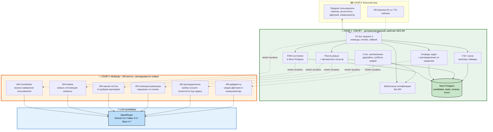
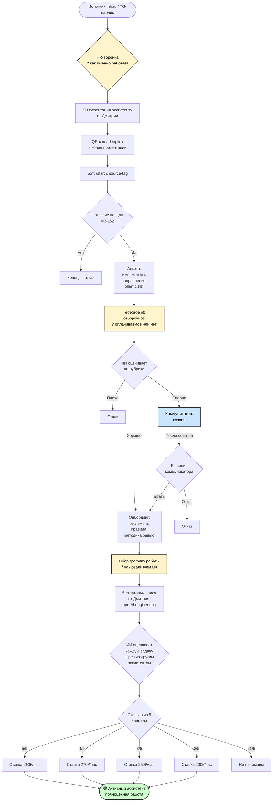
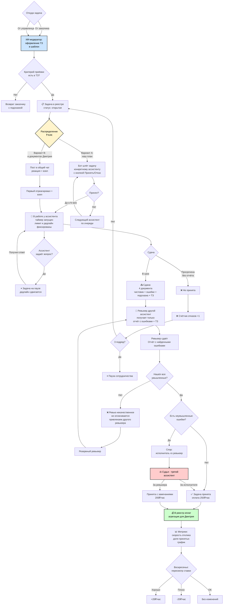
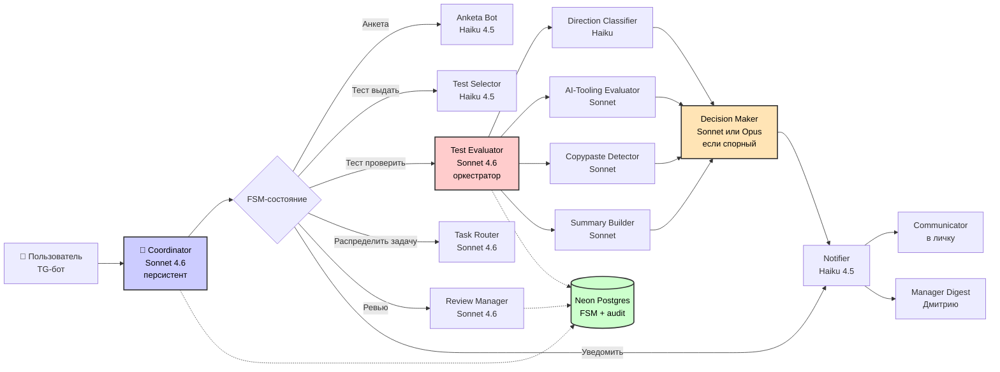

# Архитектура + Вопросы для созвона с Дмитрием

> ⚠️ **Этот документ — для разработчиков / архива.**
> Диаграммы здесь рендерятся GitHub-Mermaid в тёмной теме и могут плохо читаться. Зум невозможен.
>
> 👉 **Для созвона используй интерактивную презентацию:**
> **🔗 https://assistant-hub-7k9p2x.vercel.app**
>
> Там 16 слайдов, читаемые шрифты, навигация ←/→, раскрывающиеся блоки.

---

**Цель документа:** структурированный архив диаграмм и вопросов для разработки.

После созвона — заменяем ❓ на ответы, диаграммы становятся источником истины для разработки.

---

## 0. ГЛАВНОЕ — что определяем на созвоне

Самые критичные расхождения между тем что мы понимали и тем что в документах:

| # | Тема | Наше понимание | В документах | Вопрос |
|---|------|----------------|-------------|--------|
| 1 | **Профиль ассистентов** | Вайбкодеры / активные ИИ-пользователи | Универсалы (поиск кабинета в СПб) + AI engineering (5 стартовых задач) | Так кто целевая аудитория? |
| 2 | **Тестовые задания** | Коля придумывает сам | Дмитрий уже прислал 6 готовых задач | Что считаем за финал — Дмитрия как пример или Коля переделывает? |
| 3 | **Распределение задач** | Бот шлёт ассистенту с кнопкой "Принять" | Реакция в общем чате — "кто первый, тот взял" | **Уходим в кнопки** (наша позиция), согласовать |
| 4 | **Ревью** | v2 (потом) | v1 — обязательная часть процесса | Подтверждаем что v1, или выносим в v2? |
| 5 | **Зона ответственности** | Мы только онбординг | Полный цикл + ревью + ставки + графики | Где граница нашего MVP? |

---

## 0.5. ГЛАВНЫЙ ПРИНЦИП АРХИТЕКТУРЫ: 🦴 Скелет + 💪 Мышцы

**Центральная идея проекта:** сначала строим работающий **детерминированный скелет**, потом наращиваем **ИИ-мышцы** поверх него. Если ИИ упадёт — скелет продолжает работать. Это страховка от галлюцинаций и операционных проблем OpenRouter / OpenClaw.



### Как читать схему

- 🦴 **Скелет (зелёное)** — это первое что мы строим. Без ИИ, работает на чистом Python + Postgres + TG API.
- 💪 **Мышцы (оранжевое)** — это ИИ-агенты. **Пунктирные стрелки** означают «опционально вызывает». Если OpenRouter упал — скелет продолжает работать с шаблонными ответами.
- 🧠 **LLM** — один внешний провайдер на все агенты.

### Принцип "graceful degradation"

| Что | Со скелетом + мышцами | Только скелет (если ИИ упал) |
|-----|----------------------|-------------------------------|
| Анкета новичка | ИИ задаёт уточняющие вопросы | Жёстко по списку, 4 вопроса |
| Выбор тестового задания | ИИ подбирает под направление и уровень | Случайная задача из библиотеки под направление |
| Оценка теста | ИИ оценивает по 5 критериям + JSON-отчёт | Задача складывается в очередь Дмитрию на ручную проверку |
| Распределение задачи | ИИ выбирает лучшего ассистента | По правилу round-robin или FIFO |
| Дайджест Дмитрию | ИИ пишет красивое summary | Шаблонная таблица из БД |

### Стратегия разработки (из этого следует roadmap)

1. **Фаза 1-3:** ставим скелет полностью (без ИИ). Проверяем — пайплайн работает на ручных решениях
2. **Фаза 4-6:** наращиваем мышцы — одного агента за раз. Если что-то ломается, отключаем агента и скелет продолжает
3. **Фаза 7+:** оптимизация, multi-brain coordination, dreaming/memory

### ❓ Вопросы по этой архитектуре

- **A0.1** — Дмитрий, ты согласен с этим принципом? Это значит первые недели работы будут НА РУЧНОМ режиме (ты много нажимаешь кнопок), пока ИИ-агенты не введены.
- **A0.2** — Готов ли ты быть «оператором» в первые 2-4 недели MVP? Или нужно сразу включать ИИ хотя бы на оценку тестов?
- **A0.3** — Если ИИ ошибётся и поставит ассистенту неправильный балл — как мы возвращаемся? У нас будет «откат решения ИИ» в админ-команде бота?

---

## 1. Жизненный цикл новичка — от отклика до полноценной работы



### ❓ Вопросы по этой диаграмме

**A. HR-воронка** *(жёлтый блок)*
- На каком стеке сейчас работает воронка? (Salebot? Кастомный n8n? Sendpulse?)
- Кто её админ? Можешь дать доступ?
- Как сейчас пробрасывают кандидата дальше? Что приходит ассистенту-менеджеру?
- TG-паблики и hh.ru-вакансии — какой список и можно ли получить логи откликов?

**B. Презентация**
- Где лежит файл? Дать ссылку или PDF
- Кто редактирует? Можно ли добавить QR-код и deeplink на наш бот?

**C. Тестовое отборочное (#0)** *(жёлтый блок)*
- В документах — задача про кабинет в СПб с оплатой 500₽. Это **финальный текст** или пример?
- **Главное:** ассистент выполняет ОДНУ отборочную задачу, или сразу 5 стартовых?
- Из презентации: «Это **реальная задача** от отдела контента» — то есть отборочная задача меняется регулярно. Так?

**D. Сбор графика** *(жёлтый блок)*
- В документах: «в субботу ассистент шлёт диапазоны на след неделю минимум 6ч/день».
- Делаем ли мы это в боте через кнопки выбора времени? Или через простой текст?
- Кто подтверждает окно — модератор? Дмитрий лично? Автоматика?

**E. Коммуникатор** *(голубой блок)*
- Это **конкретный человек** (имя? username?) уже определён?
- Что он делает на созвоне? Что должно вернуться от него в систему?
- В каком формате уведомлять (личка от бота, отдельная группа, email)?

---

## 2. Жизненный цикл ЗАДАЧИ (после онбординга)



### ❓ Вопросы по этой диаграмме

**F. Распределение задач** *(жёлтый блок — ГЛАВНОЕ архитектурное решение)*

**Наша позиция:** только кнопки, никаких реакций в чате. Бот лично шлёт задачу выбранному ассистенту с кнопкой «Принять / Отказаться». Если отказался — следующему по очереди. Это:
- ✅ Не зависит от человека "кто первый успел"
- ✅ Можем балансировать нагрузку (учитываем график, текущую загрузку)
- ✅ ИИ может выбрать **наиболее подходящего** (по рейтингу/направлению)
- ✅ Чисто, есть audit trail

**Вопросы Дмитрию:**
- Согласен на этот подход? В документах указана «реакция в чате» — но это для масштаба до 5-10 ассистентов, не больше.
- По какому критерию назначать первого ассистента? (FIFO график? Лучший рейтинг? Случайно? ИИ-выбор?)
- Сколько секунд ждать ответ на «Принять/Отказаться» до перехода к следующему?
- Что если все ассистенты отказались? Эскалация Дмитрию?

**G. Оформление ТЗ ИИ-модератором**
- Это наша архитектурная идея (ИИ помогает заказчику оформить корректное ТЗ). Это нужно?
- Или ТЗ всегда оформляет человек-модератор (Дмитрий)?

**H. Ревью**
- Подтверждаешь что **каждая задача** проходит ревью? Или есть исключения (мелкие задачи без ревью)?
- Лимит времени на ревью — отдельно или включён в общий лимит задачи?
- Кто выбирает ревьюера? Случайно? По очереди? Любой свободный?
- Что если **некому делать ревью** (все заняты)?
- Кто судья — отдельная роль, тоже ассистент, или ты сам?

**I. Подача задачи — 4 документа**
- Каждая задача требует 4 документов: чистовик + ошибки + подсказка + ТЗ. Это нагрузка. Точно для **каждой** задачи или только для определённых?
- Как ассистент создаёт эти документы — мы помогаем шаблонами? Или это его головная боль?

**J. Метрики и пересмотр ставки**
- В документах: «раз в неделю управленец смотрит на ваш рейтинг». Это автоматически через ИИ-агента или ручной процесс Дмитрия?
- Что делаем мы — собираем метрики или сами принимаем решение о ставке?

---

## 3. Multi-brain агенты внутри (наша архитектура)



### ❓ Вопросы по multi-brain

**K. Глубина автоматизации**
- Сколько решений принимает ИИ автономно vs «передать человеку»?
- Например: ИИ может **сам** распределить задачу подходящему ассистенту, или это всегда **рекомендация** Дмитрию?
- По ТК РФ ст.86 — автоматический отказ кандидата запрещён. Согласован ли с тобой подход «ИИ-рекомендация + кнопка человеку»?

**L. Модератор как сущность**
- В документах **«модератор»** — отдельная роль. Это:
  - Конкретный человек (ты, Дмитрий, помощник)?
  - Или ИИ-агент (наша Coordinator)?
  - Или **гибрид** (ИИ делает черновую работу, человек подтверждает)?

---

## 4. Полный список вопросов по категориям (для созвона)

### A. Профиль ассистентов и направления
- A1. Какая **реальная** целевая аудитория ассистентов? Универсалы или AI-эксперты?
- A2. Список **актуальных направлений** работы (вайбкодинг? копирайт? дизайн? SMM? аналитика?)
- A3. Уровни внутри направления (junior/middle/senior) — есть?
- A4. Заказчики каких отделов сейчас просят ассистентов? (контент, разработка, SMM?)

### B. Тестовые задания
- B1. Документы Дмитрия с 6 тестами — **это финал или черновики**?
- B2. Сколько разных вариантов отборочного теста (#0) хотим иметь в библиотеке?
- B3. 5 стартовых задач — фиксированный набор для всех направлений или разные под направление?
- B4. Можем ли мы **переписывать** тексты тестов или строго следуем оригиналу Дмитрия?

### C. Распределение задач (наша главная архитектурная позиция)
- C1. **Уходим от реакций в общем чате → переходим на кнопки в личке.** Согласен?
- C2. Логика выбора первого кандидата на задачу: график / рейтинг / FIFO / ИИ-выбор?
- C3. Таймаут ответа на «Принять» до перехода к следующему?
- C4. Эскалация если никто не взял?
- C5. Один общий чат для **уведомлений** оставляем, но не для распределения?

### D. Архитектура коммуникации
- D1. Один бот для всех ролей (новичок / ассистент / коммуникатор / Дмитрий) — ОК?
- D2. Нужен ли общий чат для **анонсов** (без распределения)?
- D3. Личные чаты бота с каждым — да?
- D4. Группа Дмитрий+коммуникатор+Коля для эскалаций?

### E. Ревью и судейство
- E1. Ревью на **каждую** задачу — подтверждаем?
- E2. Кто выбирает ревьюера (ИИ / Дмитрий / случайно)?
- E3. Время на ревью — включено в общий лимит или отдельная задача с своим лимитом?
- E4. Судья — отдельная роль (третий ассистент) или Дмитрий лично?
- E5. Что если ревьюера нет (все заняты)?

### F. Финансы и метрики
- F1. Подтверждаем ставки: 250 / 200 (+20 во внерабочее) / потолок 360 / шаг 20?
- F2. Расчёт ставки после 5 стартовых: 290/270/250/200/отказ — подтверждаем?
- F3. Метрики еженедельного пересмотра: скорость отклика, доля принятых, график. Что-то ещё?
- F4. Решение о ставке — ИИ-рекомендация или Дмитрий вручную?
- F5. Передача данных для выплат: какой формат?  
  (Дмитрий обещал шаблон сообщения для сбора реквизитов карты)

### G. Зона ответственности — границы MVP
- G1. **Что Наша зона:** онбординг ✅ / распределение задач ✅ / ревью ✅ / метрики ✅ / реестр часов ✅
- G2. **Что Зона Дмитрия:** приём заказов от клиентов / финальные выплаты / налоги / договоры
- G3. **Что Зона коммуникатора:** созвоны со спорными кейсами / личная мотивация
- G4. **Что общее:** решения о приёме/отказе кандидатов / решения по спорам по работе

### H. Доступы и инфраструктура (ACCESS_REQUESTS)
- H1. **OpenRouter API ключ** — Дмитрий выдаёт свой или Коля создаёт под проект?
- H2. **Neon Postgres** — создаём новую базу `assistant_hub`. Кто платит при росте?
- H3. **TG Bot tokens** — два бота (dev/prod). Кто владелец, кто платит за хостинг?
- H4. **WSL2** — Коле установить (нужно для OpenClaw на Windows). Сделать.
- H5. **Шаблоны корпоративных Google Docs** — есть отдельная папка «Шаблоны». Дать доступ.
- H6. **VPS** (для прод-фазы) — кто выбирает / платит?

### I. Юридика и ПДн
- I1. ФЗ-152: нужно согласие на ПДн при первом контакте с ботом. Какой формальный текст использовать?
- I2. ТК РФ ст.86: автоматический отказ запрещён → договорились что ИИ только рекомендует, решение Дмитрия / коммуникатора?
- I3. Neon в Frankfurt (eu-central-1) — формальное нарушение требования локализации. Решение: согласие + договор поручения обработки или сменить регион Neon?
- I4. hh.ru API ToS запрещают передачу данных кандидатов третьим API (OpenRouter). Что делаем? Псевдонимизация перед оценкой?
- I5. Самозанятые ассистенты + чеки — это твоя сфера, мы только передаём данные?

### J. Сроки и приоритеты
- J1. Когда нужен MVP "под нагрузку" (первые реальные кандидаты)?
- J2. Сколько кандидатов в день/неделю ожидаем на старте?
- J3. Сколько активных ассистентов планируется через 1 / 3 / 6 месяцев?

---

## 5. Чек-лист для созвона (распечатать / открыть рядом)

После каждого вопроса — место для ответа. Можно открыть этот документ в редакторе и заполнять прямо во время созвона.

```
A1. Профиль ассистентов: ___________________________
A2. Направления: ___________________________________
B1. Тесты - финал или черновик: ____________________
B3. Стартовые задачи под направление?: _____________
C1. Кнопки вместо реакций — согласен?: _____________
C2. Логика выбора ассистента: ______________________
E1. Ревью на каждую задачу?: _______________________
E2. Кто выбирает ревьюера: _________________________
E4. Кто судья: _____________________________________
F1. Ставки подтверждаем?: __________________________
F4. Решение о ставке — ИИ или ты вручную: __________
G1. MVP-границы согласованы?: ______________________
H1. OpenRouter ключ — твой или Коля?: ______________
H2. Neon — кто платит при росте?: __________________
I1. Согласие на ПДн — формальный текст?: ___________
J1. Дедлайн MVP: ___________________________________
J2. Кандидатов в день/неделю: ______________________
```

---

## 6. Если на созвоне есть **время — обсудить дополнительно**

- **Дашборд через TG-команды** vs **Веб-дашборд** — Коля считает что TG-команд хватит в MVP, веб = v3
- **Сбор реквизитов карты** через шаблон сообщения от тебя — когда нужен (в v2 при первой ЗП?)
- **Самостоятельная роль коммуникатора в боте** — он использует те же команды что Дмитрий?
- **Прототип UI** на v0.dev / bolt.new / lovable.dev — показать варианты экранов на следующем созвоне

---

## Сразу после созвона

1. Коля заполняет ответы в этом документе
2. Если ответы существенно меняют курс — обновляем `PROJECT.md` и `REQUIREMENTS.md`
3. Делаем `git commit + push`
4. Запускаем `/gsd:plan-phase 1` — переходим к детальному планированию первой фазы (boot OpenClaw)
